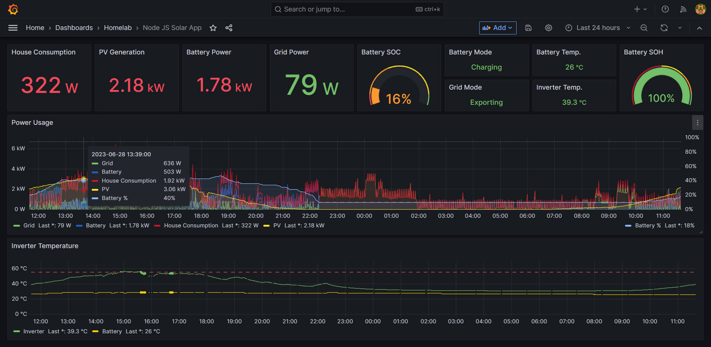
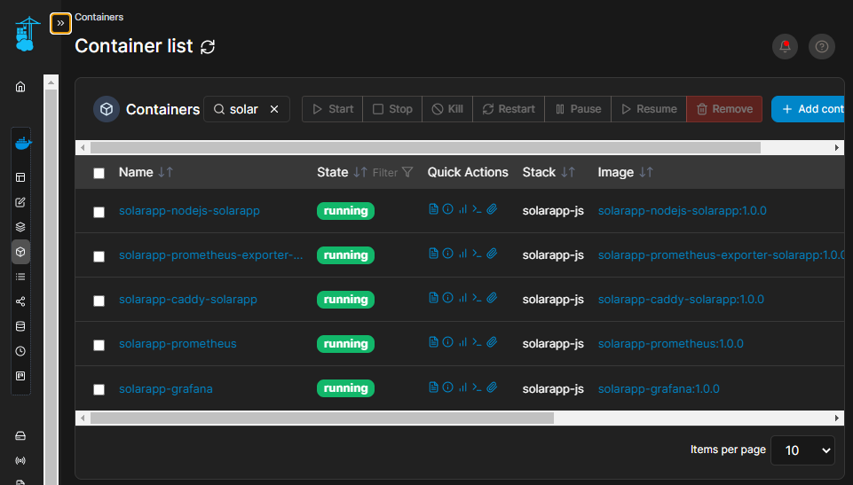
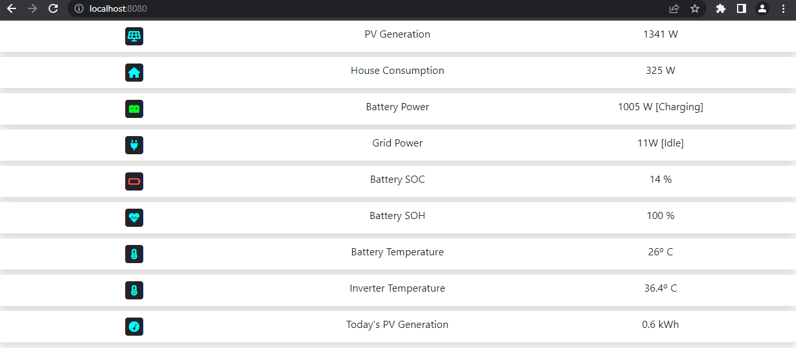
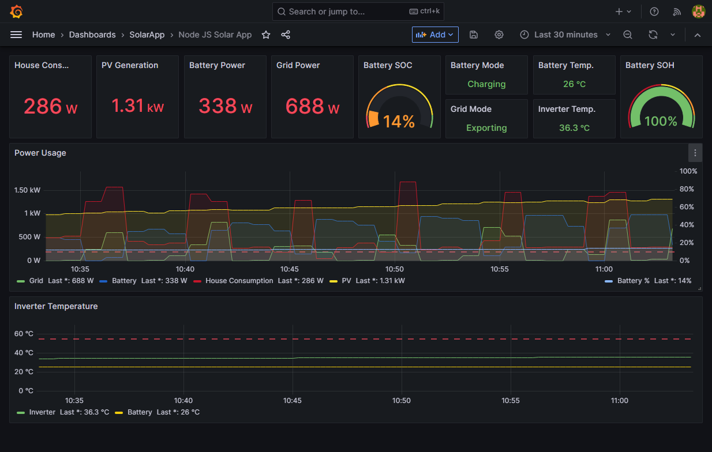
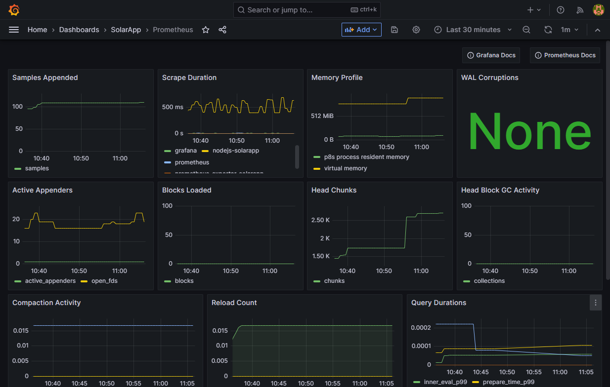
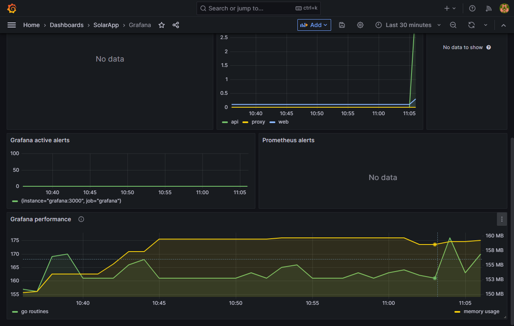
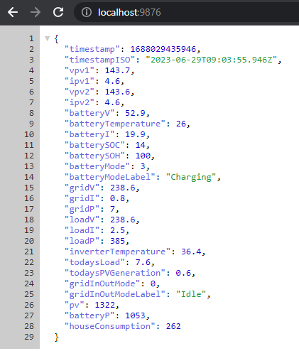
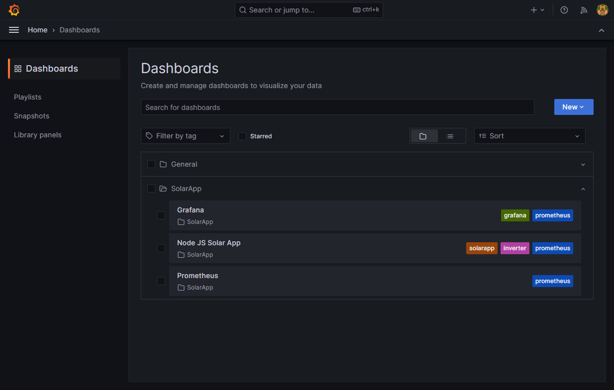
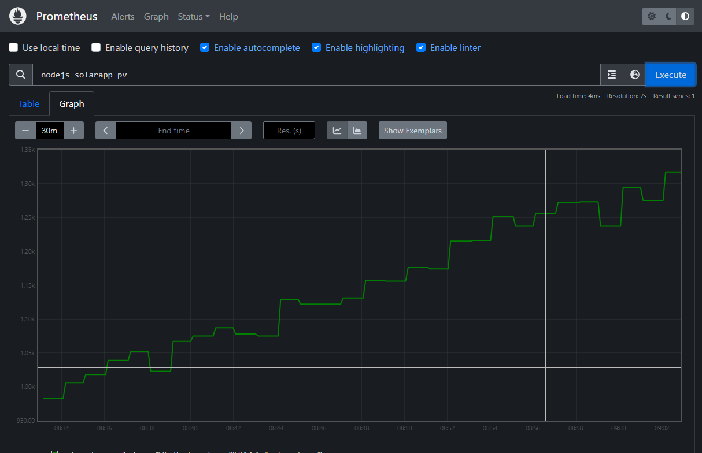

# Solar App

## Introduction



I have a **Goodwe** *GW5048-ESA* inverter installed at home and the applications provided (**PV Master** and **SEMS portal**) are not enough to monitor the data the way I want.

While they work, **PV Master** is extremely slow to use (at least on *Android* phone) and the **SEMS portal** is good and provides historic data but it's an online service, so if I don't have internet connectivity I can't see the stats over the last X hours, and why should I have to go online when I have the inverter at home? 😉

This project came out of the necessity to monitor my solar inverter without the need to connect to any of those apps, so I wrote a small **NodeJS** program to pull some stats and store/display them the way I wanted.

At the time I started this project there was no **Home Assistant** integration yet, but I do see [there is one now](https://www.home-assistant.io/integrations/goodwe) which might be better, but either way if you like tinkering and decide to experiment with a **Docker** installation keep reading.

Please note this code is for my particular inverter model, if you have something different you can reuse pieces and adapt to yours (even if it's not a **Goodwe** one). I built the containerized solution, wrote some pieces of code, used some parts of other projects, and even disassembled **PV Master** to try and figure out how to read some values. I'll add links at the bottom for reference. Good luck! 😀

## Setup
The only thing that is needed is **Docker** to run the containers.
How it works is out of scope for this repo, there are plenty of tutorials out there for you to learn.

Also in my particular setup I have it under a **Traefik** proxy, but I thought it was overkill for this simple repo.

You just have to clone it and modify the file **./nodejs-solarapp/src/index.js** to change the *IP address* of your inverter and put the one from yours:
```javascript
...
const port = process.env.PORT || 9876;

const inverterAddress = '192.168.1.150'; // Replace your IP address here
const message = functions.hexToBytes('aa55c07f0106000245');

const GridInOutMode = {
...
```

If some of the ports used in this configuration collide with ones you already have, just do a global search in the solution and replace with the ones you wish.

Then if you're happy with the remaining settings for ports and such just build the images:
```shell
docker compose build
```

And finally spin the containers up:
```shell
docker compose up -d
```

You should be able to see them (for example in **Portainer**):



## Usage

The main app is located at [http://localhost:8080](http://localhost:8080) which will give you the current status of the inverter:


I have also included a Grafana instance with some predefined dashboards so you can query the data in a more visual way, you just need to browse to [http://localhost:3000](http://localhost:3000) and check the provisioned dashboards.

There are three dashboards included in this Grafana instance:
- **NodeJS Solar App** provides the main stats of the inverter.


- **Prometheus** provides Prometheus' own stats.


- **Grafana** provides Grafana's stats



They may not be 100% ok but for the purposes of what I need they work just fine.

## Endpoints

Once the containers are up and running, you can access the endpoints via a regular browser in the following addresses:

### Inverter application
- http://localhost:8080 => Main UI, gives the actual status


- http://localhost:9876 => **NodeJS** app to query actual stats, returns *JSON*


- http://localhost:7979/metrics => **Prometheus** exporter for the statistics

### Grafana instance
The default credentials defined in the *docker_compose.yml* file are **admin/password**, feel free to change them to whatever you like.
- http://localhost:3000 => Main UI


- http://localhost:3000/metrics => **Prometheus** metrics endpoint

### Prometheus instance
- http://localhost:9090 => Main UI


- http://localhost:9090/metrics => **Prometheus** metrics endpoint

## References
**Goodwe** doesn't provide documentation on how to access inverter data via *UDP*, so I used as reference the work of other people to pick the pieces I would need, as well as some disassembling, these are the ones I can remember:

- https://github.com/mletenay/home-assistant-goodwe-inverter
- https://github.com/marcelblijleven/goodwe

As such, I *think* some calculations might not be accurate 100%, especially the ones regarding the PV daily generation, as I do see a weird offset compared to what I see on the **SEMS** portal but again, in the portal I do not see the inverter temperature for some reason when I get a report (even though it IS being generated and I DO see it in realtime) so not a big deal.

Also, I have the polling for stats with **Prometheus** every minute. If you lower it you can get more detailed information but for some reason the inverter my become "overloaded" and not respond correctly. You may also see blanks in the capture points but again, not a big deal for me.

The code is provided as-is, you can download and use it in any way you like, just remember this is for my particular model, so you'll need to change it if you need anything different.

Finally if you like this you can also [buy me a coffee](https://paypal.me/gamosoft). 😎

Thanks, I hope you enjoy this project!